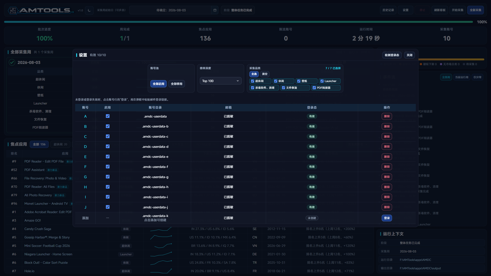
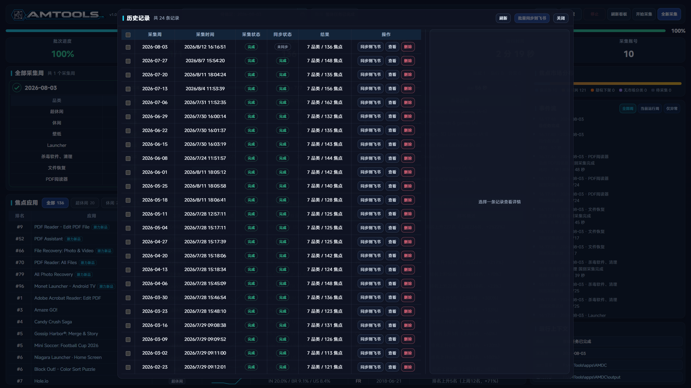

# AMTools

当前版本：`1.0`。

AMTools 是面向应用市场研究的数据采集与分析工具集。项目将 AMDC 的 AppMagic 周榜采集、历史管理和飞书同步，与 AMDA 的市场分组分析、图表和飞书报告整合在同一仓库中，并通过共享契约保持两端数据一致。

## 主要功能

- 同时覆盖超休闲、休闲、壁纸、Launcher、杀毒软件与清理、文件恢复、PDF 阅读器七个品类。
- 支持最多 20 个独立账号、多周批量任务，以及 Top 100 / Top 1000 榜单深度。
- 普通采集优先复用已验证缓存；发现榜单与历史排名不一致时，自动转为全新采集。
- 根据排名、历史轨迹、上线日期、发行商和市场结构识别重点应用、首次进入 Top 100 和潜力新品。
- 独立检查焦点应用的商店可用性；确认下架时保留历史市场数据，网络失败或限流不会覆盖已确认状态。
- 本地看板展示批次进度、品类状态、焦点应用、排名轨迹、市场分布、事件流和运行上下文。
- 每次采集保留独立历史记录，可导出 Excel、单条或批量同步飞书电子表格。
- AMDA 对已批准的周度数据执行下载侧 IAA、收入侧 IAP、国家分组、趋势和品类分析，并生成图表与飞书报告 Demo。
- Windows 计划任务负责每周采集和每日账号同步；运行状态通过日志和 ntfy 通知留痕。

## 功能页面

| 设置与采集配置 | 历史记录与飞书同步 |
|---|---|
|  |  |

### 分析产出

AMDA 只读取范围已确认且通过质量门禁的数据。正式市场分析文档包括全球分组、周期趋势、品类结构、重点国家及数据边界。

## 快速开始

### 环境要求

- Windows 10/11
- Node.js 18 或更高版本
- Python 3 与 `openpyxl`
- PowerShell 7（`pwsh`）

### 安装

```powershell
git clone https://gitee.com/Hawkiethehawk/AMTools.git
Set-Location .\AMTools
pwsh.exe -NoProfile -File .\apps\AMDC\scripts\deploy.ps1
```

部署脚本安装根项目和 AMDC 依赖，注册 `amtools`、`amdc` 命令，并把 AMDA 注册到本机 Agent Skill 目录。飞书工具链使用根项目锁定的 `@larksuite/cli`，不依赖全局版本。

首次使用：

```powershell
amdc setup
amdc doctor --json
amdc login
amdc start
```

看板默认地址为 `http://127.0.0.1:8787`。

## 命令一览

AMDC 以人工看板操作为主，同时提供稳定的 JSON 接口供 AI Agent 调用。真实采集、飞书同步和计划任务注册都需要显式确认。

| 命令 | 说明 |
|---|---|
| `amdc doctor [--json]` | 检查运行环境、项目路径和依赖 |
| `amdc status [--json]` | 实时检查账号登录状态并显示脱敏邮箱 |
| `amdc login [profile]` | 登录指定账号 profile |
| `amdc start` / `stop` / `restart` | 管理本地看板 |
| `amdc collect plan ... --json` | 生成带本机签名的采集计划，不启动采集 |
| `amdc collect run --plan <path> --yes` | 执行已审查的采集计划 |
| `amdc run status [--json]` | 查看当前或最近批次状态 |
| `amdc run wait --batch-id <id>` | 等待指定批次结束 |
| `amdc history list [--json]` | 列出历史记录 |
| `amdc sync feishu <history-id> --yes` | 将指定历史记录同步到飞书 |
| `amdc schedule doctor [--json]` | 检查 Windows 任务、PowerShell 7 路径和最近结果 |
| `amdc schedule install --yes` | 注册每周采集和每日账号同步任务 |
| `amdc config show [--json]` | 显示脱敏后的合并配置 |
| `amtools doctor --json` | 检查 AMTools 仓库级依赖与模块连线 |
| `amtools version --json` | 显示统一项目版本 |
| `amtools amda analyze ...` | 执行 AMDA 分析命令 |
| `amtools pipeline validate <manifest>` | 校验跨模块 CollectionManifest |

AI Agent 的完整操作和授权规则见 [AGENTS.md](AGENTS.md) 与 [AI Agent 操作指南](docs/AI-AGENT-OPERATIONS.md)。

## AMDC 数据采集

### 多账号与多周任务

AMDC 支持 A 至 T 共 20 个独立 Chromium profile。账号登录态互相隔离，采集时由已启用账号共同处理当前周任务。多周任务按采集周从新到旧依次执行，当前周完成后才进入下一周。

看板中的日期选择只接受已过去的周一。榜单深度支持 Top 100 和 Top 1000；账号池、品类和深度都在任务启动前由服务端再次校验。

### 普通采集与全新采集

- **普通采集**优先复用已通过校验的榜单和应用缓存，以缩短重复采集时间。
- 若当周榜单与历史排名发生差异，普通采集会自动切换为全新采集，重新请求相关数据。
- **全新采集**忽略可复用缓存，适合修复历史数据、验证榜单变化或重新生成完整结果。

### 应用发现与商店状态

重点应用由当前排名、上周排名和历史轨迹共同判断。潜力新品还会检查发行商、上线日期和成熟市场表现，避免只凭一次排名变化得出结论。

所有焦点应用在导出前独立核验商店链接。确认 404 时标记为默认下架，但保留历史国家数据；429、超时或网络失败只记录本次失败，不覆盖之前的可用或下架结论。后续恢复访问时会自动清除下架状态。

### 历史、Excel 与飞书

每次运行保存为独立历史批次，并记录来源、采集周、品类、状态、结果摘要和飞书同步状态。Excel 与飞书工作表使用一致的列顺序、链接、日期和品类样式。手动同步必须由用户确认；定时任务仅在采集和导出成功后自动同步。

## AMDA 数据分析

AMDA 使用明确的 `CollectionManifest` 或不可变数据快照作为分析入口，不直接读取未确认的临时结果。

分析流程包括：

1. 确认分析截止日期和纳入的周度工作表。
2. 校验记录数、下载/收入国家数据、缺失率和品类收入覆盖率。
3. 以“应用 × 周”为基本单位，分别计算下载侧和收入侧的 Top 5 国家地区结构。
4. 使用 US、T1、T2、T3 主分层及拉美、东南亚、IN 补充观察组分析趋势和品类差异。
5. 生成全球结构、周期趋势、品类方向、重点国家和补充地区图表。
6. 先更新飞书 Demo 并回读验证；正式文档只有在用户确认后才能覆盖。

下载侧用于判断 IAA 用户规模和潜在广告库存偏好，收入侧用于判断 IAP 收入偏好。收入数据覆盖率不足时只保留方向性观察，不作精确收入排序。

## 自动化与账号备份

Windows 上通过 PowerShell 7 注册两个计划任务：

| 任务 | 默认时间 | 作用 |
|---|---:|---|
| `AMDC Account Sync` | 每日 09:05 | 检查账号登录态、清理可重建 Chromium 缓存，并备份有效账号配置 |
| `AMDC Weekly` | 每周三 09:30 | 采集上周数据、生成 Excel、同步飞书，并在成功后触发一次 AMDA Demo 更新 |

```powershell
amdc schedule install --yes
amdc schedule doctor --json
```

计划任务要求用户已登录，执行程序必须是 PowerShell 7 的 `pwsh.exe`。账号备份目标从本机私有配置读取，且必须保持私有。账号同步不是数据采集任务，也不会触发 AMDA。

## 配置与安全

AMDC 私有配置位于 `apps/AMDC/amdc-config.json`，由 Git 忽略。飞书表格和账号备份仓库分别通过以下字段配置：

```json
{
  "integrations": {
    "feishuSheetUrl": "",
    "accountRepositoryUrl": ""
  }
}
```

AMDA 的工作簿和正式文档地址保存在 `%LOCALAPPDATA%\am-market-analytics\resources.json`。也可以使用 `AM_MARKET_ANALYTICS_CONFIG` 指定其他本机配置文件。

以下内容不得提交到仓库：

- AppMagic 登录态、账号 profile、令牌和 Cookie
- `amdc-config.json` 与本机资源地址
- 缓存、日志、运行历史、Excel 和临时分析产物
- 私有飞书、账号备份仓库或通知服务的凭据

真实采集、飞书同步、正式文档覆盖、账号备份和远程推送都必须取得明确授权。

## 目录结构

```text
AMTools/
├── apps/AMDC/             # 采集、账号、缓存、历史、Excel、飞书同步和看板
├── skills/AMDA/           # 市场分析 Skill、图表和飞书报告流程
├── packages/contracts/    # 跨模块数据契约
├── orchestrator/          # 仓库级编排与状态传递
├── tests/                 # 根 CLI 与共享契约测试
├── docs/                  # Agent 文档与公开截图
├── amtools.js             # 统一 CLI 入口
├── VERSION                # AMTools 唯一版本源
└── package.json           # 根依赖与检查入口
```

AMDC 和 AMDA 不维护独立版本。旧仓库归档只用于历史参考，不参与运行或发布。

## 开发检查

```powershell
npm run cli:test
npm run contracts:test
npm run amdc:syntax
npm run amdc:test:contract
npm run amdc:test:feishu-order
npm run pipeline:dry-run
```

这些检查不执行真实采集、飞书同步、账号备份或正式文档写入。

## 许可

`apps/AMDC` 的许可见其 `LICENSE`。其他目录如未提供单独许可文件，则保留相应权利。
